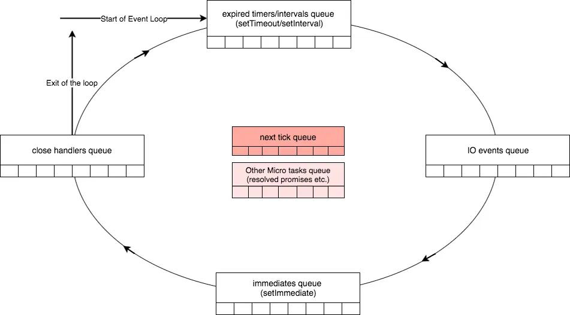
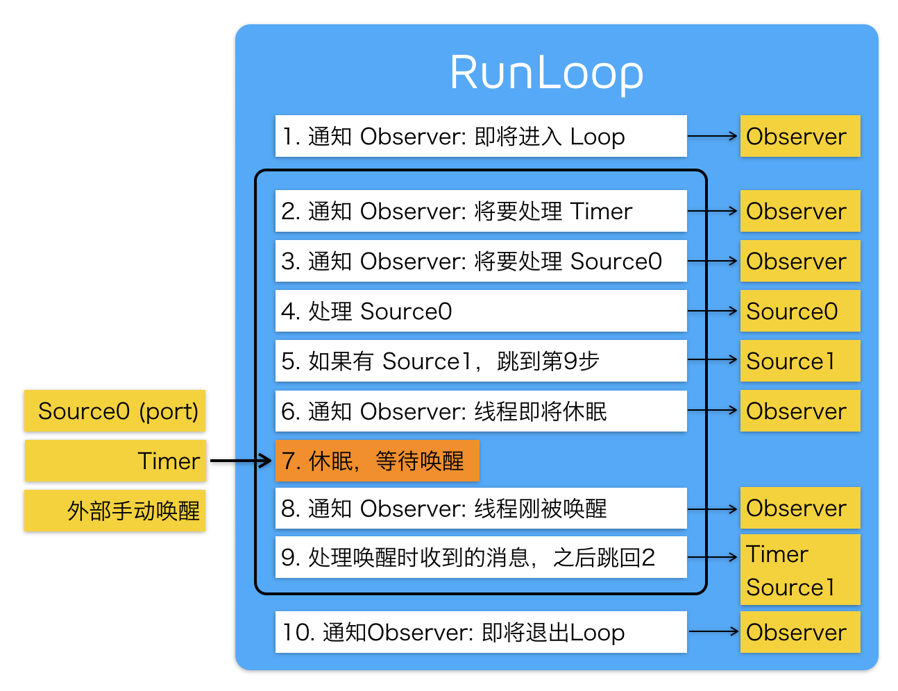

在看JS面试题发现JS的eventloop 和OC中的Runloop结构类似，记录下

## 一、浏览器端JS的EventLoop
示意图(来源 [@nekron](https://juejin.im/user/59659aff5188250cf956e6dd))

定义：
- 宏任务：主代码、setTimeout、setInterval 、UI交互事件
- 微任务：Promise 、mutation observer

流程：
1. 执行一次task
2. 执行微任务（MicrotaskQueue），直到队列清空
3. 执行UI render（JS引擎线程被挂起等待，GUI渲染线程开始运行）

## 二、node环境的EventLoop

node整体结构示意图（来源：[@ImNeutralChaos](https://twitter.com/ImNeutralChaos/status/494959181871316992))

node的EventLoop 示意图(来源 [@nekron](https://juejin.im/user/59659aff5188250cf956e6dd))

- Node的Event Loop分阶段，阶段有先后，依次是
  - expired timers and intervals，即到期的setTimeout/setInterval
  - I/O events，包含文件，网络等等
  - immediates，通过setImmediate注册的函数
  - close handlers，close事件的回调，比如TCP连接断开
- 同步任务及每个阶段之后都会清空microtask队列
  - 优先清空next tick queue，即通过- process.nextTick注册的函数
  - 再清空other queue，常见的如Promise

而和规范的区别，在于node会清空当前所处阶段的队列，即执行所有task

### 三、OC的RunLoop

示意图(来源：[@ibireme](https://blog.ibireme.com/2015/05/18/runloop/))

定义：
  
- Observer: runloop 各阶段的事件监听
- Source: source0 内部事件监听 source1 基于mach_Port的,外部事件监听
- Timer：定时器  

## 参考资料

> - [Event Loop的规范和实现](https://juejin.im/post/5a6155126fb9a01cb64edb45)
> - [结合JS运行机制，理解Event Loop](https://juejin.im/post/5eaa433ae51d454def2262ce)
> - [详解JavaScript中的Event Loop（事件循环）机制](https://zhuanlan.zhihu.com/p/33058983)
> - [JavaScript 运行机制详解：再谈Event Loop](http://www.ruanyifeng.com/blog/2014/10/event-loop.html)
> - [深入理解RunLoop](https://blog.ibireme.com/2015/05/18/runloop/)
